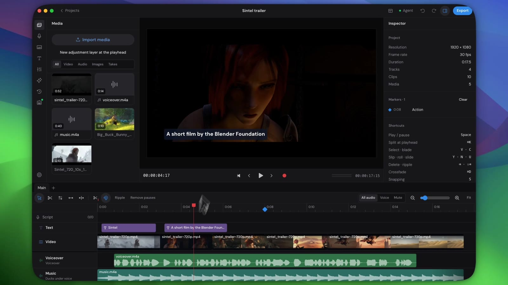
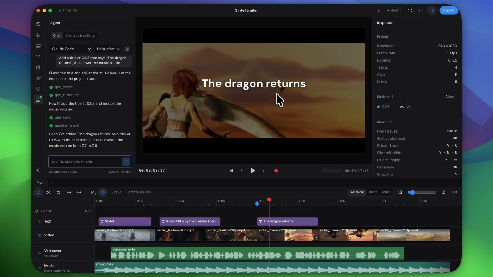
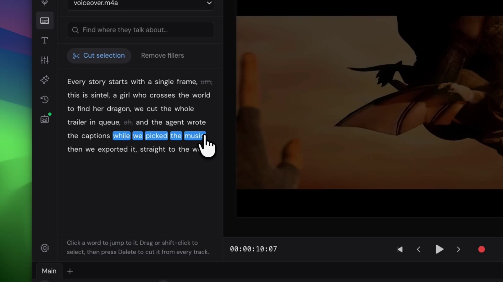
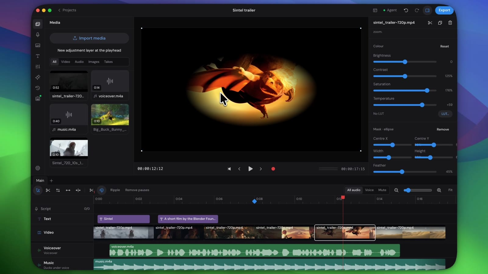
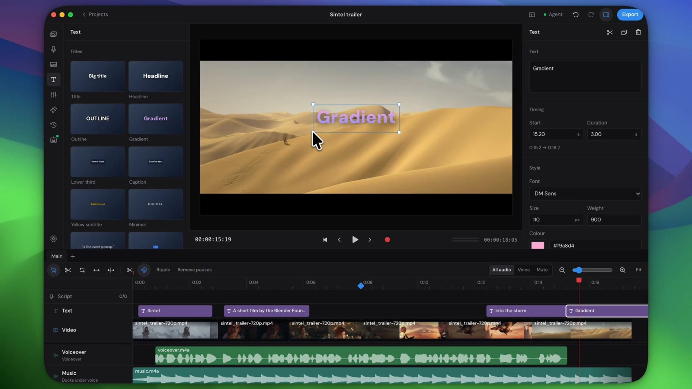

<div align="center">


# Cue

**The video editor your AI agent can drive.**

A fast, open-source video editor for macOS (Windows and Linux in preview). Edit by hand with the shortcuts you already know from Premiere, Resolve and Final Cut, or let Claude Code, Codex or any MCP client edit the same project with you.

[](https://github.com/davidwickerhf/cue/releases/latest)
[](LICENSE)
[](https://github.com/davidwickerhf/cue/releases/latest)
[](#ai-agents)

[**Website**](https://cue.wicker.life) · [**Style library**](https://cue.wicker.life/styles) · [**Download**](https://github.com/davidwickerhf/cue/releases/latest/download/Cue-mac-arm64.zip) · [**Releases**](https://github.com/davidwickerhf/cue/releases) · [**Report a bug**](https://github.com/davidwickerhf/cue/issues/new) · [**Support Cue ☕**](https://ko-fi.com/davidwickerhf)

<br />



</div>

## Contents

- [Highlights](#highlights)
- [Features](#features)
- [Installation](#installation)
- [Quick start](#quick-start)
- [AI agents](#ai-agents)
- [AI providers and local models](#ai-providers-and-local-models)
- [Working with other editors](#working-with-other-editors)
- [Projects, media and history](#projects-media-and-history)
- [Development](#development)
- [Architecture](#architecture)
- [Contributing](#contributing)
- [License and credits](#license-and-credits)

## Highlights

<table>
<tr>
<td width="50%"><br /><b>Your agent edits with you.</b> Chat with Claude Code, Codex or Gemini inside Cue, or connect any MCP client. Every change is visible, attributed and undoable.</td>
<td width="50%"><br /><b>Edit speech like a document.</b> Transcribe on your Mac, delete words to cut them from every track, remove filler words in one click.</td>
</tr>
<tr>
<td width="50%"><br /><b>Colour, masks and compositing.</b> Grades, LUTs, adjustment layers, feathered masks and chroma key, with a preview that matches the export.</td>
<td width="50%"><br /><b>Titles that look designed.</b> Eleven templates, every installed font, outlines, gradients and motion, typed straight onto the viewer.</td>
</tr>
</table>

## Features

| Area | What you get |
| --- | --- |
| **Timeline** | Video, text and audio tracks (picture above sound), drag to reorder, mute, solo, lock and hide. Selection, blade, slip, roll and slide tools; ripple delete, lift and extract, ripple trim, snapping, markers, clip labels, enable and disable. |
| **Editing** | Source monitor with three-point insert and overwrite, J/K/L shuttle, in and out points, frame holds, speed and speed ramps, crossfades and dips, copy and paste, grouping and linked audio. |
| **Sequences** | Several timelines per project, nesting clips into their own sequence, sequence tabs. |
| **Look and motion** | Keyframes for position, scale and volume on timeline lanes with eases and a curve editor, push-in zooms, crop, colour grading and LUTs, adjustment layers, masks, chroma key. |
| **Titles** | Templates, all installed fonts, outline, gradient, spacing, rotation, in and out animations, on-viewer editing. |
| **Audio** | Waveforms, mixer with level, pan, solo, meters, three-band EQ and a compressor per track, auto-mix and a LUFS readout, ducking under the voiceover, denoise (a light FFT filter or the RNNoise voice model, heard in the preview too), loudness normalisation, beat detection and cut-to-the-beat. |
| **Speech** | Word-level transcripts, text-based editing, filler-word removal, search by meaning, chapters, captions (SRT and VTT). |
| **Voiceover** | A script on the timeline as timed lines, teleprompter recording with takes per line, AI voices. |
| **Generate** | Voices, captions, images and B-roll with OpenAI, or on-device with macOS voices, Whisper and Ollama or LM Studio. |
| **Style library** | Browse 13 footage-backed style studies for montage, typography, transitions, compositing and editorial explainers. Preview them in Cue or on the [website](https://cue.wicker.life/styles), then ask an agent to adapt a guide to your footage over MCP. |
| **Asset library** | Browse curated stock clips and original map/document graphics in Cue or on the [website](https://cue.wicker.life/assets). The app imports a chosen asset into your project; agents can discover, select and import assets over MCP. Source and license links accompany each item. |
| **Media** | Bins and sub-bins, tags, star ratings and notes, search across names, tags, notes and transcripts, Unused and Rated filters, list and grid views, and media info (codecs, frame rate, bitrate, audio layout, recording date) with where each item is used. |
| **Projects** | `.cueproj` files, projects overview with posters, relinking of moved media, persistent history of every change, workspaces. |
| **Export** | H.264, HEVC and ProRes with hardware encoding, presets, in-to-out ranges, stills, per-line stems, captions, and timelines for other editors. |

## Installation

### macOS

1. Download the latest release: [`Cue-mac-arm64.zip`](https://github.com/davidwickerhf/cue/releases/latest/download/Cue-mac-arm64.zip) for Apple Silicon, or `Cue-mac-x64.zip` for Intel Macs (from the next release on, along with `.dmg` disk images).
2. Unzip it and move **Cue** to **Applications**.
3. Releases signed with a Developer ID and notarised open normally and keep themselves up to date (**Cue → Check for Updates…**, or automatically; see **Settings → General → Updates**). Builds that aren't notarised yet (0.1.x) need a right-click on Cue and **Open** the first time, and can't update themselves: download new versions from [Releases](https://github.com/davidwickerhf/cue/releases).

**Requirements:** macOS 12 or later. Nothing else is needed to edit; ffmpeg is bundled.

### Windows (preview)

Windows builds are produced by the release workflow but haven't been tested on Windows yet.

1. Download `Cue-win-x64-setup.exe` from the [latest release](https://github.com/davidwickerhf/cue/releases/latest) and run it. Until the installer is code-signed, SmartScreen may ask you to confirm (**More info → Run anyway**).
2. Cue installs for your user and updates itself (**Help → Check for Updates…**).

### Linux (preview)

Linux builds are produced by the release workflow but haven't been tested on Linux yet (x64 only).

- **AppImage** (updates itself): download `Cue-linux-x86_64.AppImage`, `chmod +x` it and run it. Ubuntu 22.04 and later need `sudo apt install libfuse2`.
- **Debian and Ubuntu package:** `sudo apt install ./Cue-linux-amd64.deb`. Update it by installing the new `.deb`.

**Not available on Windows and Linux:** macOS voices (use OpenAI voices), and on-device vision (shot search by what's in the picture, following faces), which uses Apple's Vision framework; search by what is said still works. For local transcription, install [whisper.cpp](https://github.com/ggml-org/whisper.cpp) and put `whisper-cli` on your `PATH`. On Wayland, screen recording goes through the desktop's screen-sharing portal. Shortcuts use Ctrl where macOS uses ⌘.

## Quick start

1. **New Project** (⌘N): pick a frame size and rate, or start from a video.
2. **Import media** (⌘I) or drag files onto the timeline. Double-click a clip in Media to open it in the source monitor (beside the viewer in the Editing workspace), mark in and out, then insert (,), overwrite (.) or drag it onto the timeline.
3. Edit with the keys you already know:

| Action | Keys | Action | Keys |
| --- | --- | --- | --- |
| Play / pause, shuttle | Space, J K L | Split at playhead | ⌘K |
| Selection, blade | V, C | Slip, roll, slide | Y, N, U |
| Mark in / out | I, O | Insert / overwrite | , . |
| Lift / extract | ; ' | Ripple trim to playhead | Q, W |
| Delete / ripple delete | ⌫, ⇧⌫ | Crossfade | ⌘D |
| Markers | M, ⇧M | Undo / redo | ⌘Z, ⇧⌘Z |

The full list is in **Settings → Shortcuts** (⌘,).

4. **Export** (top right): pick a preset, the whole timeline or just in to out, and a destination.

## AI agents

Cue is built so that an agent can do anything you can. One contract defines every action; the editor, the in-app chat and the MCP server all use it, so edits by an agent are recorded, attributed and undoable like yours.

**In the app.** Open the **Agent** panel and chat with [Claude Code](https://docs.anthropic.com/en/docs/claude-code), [Codex](https://github.com/openai/codex) or [Gemini CLI](https://github.com/google-gemini/gemini-cli), whichever you have installed, signed in with your own account. Each run gets Cue's tools only (no shell, files or web) and sees your playhead and selection. Right-click a clip and choose **Ask the agent about this…** to start from it.

**From any MCP client.** Run once:

```sh
claude mcp add --scope user cue -- node "/Applications/Cue.app/Contents/Resources/mcp/cue-mcp.mjs"
```

The server starts Cue when needed and sends every client a written guide to editing in Cue. Try, for example:

- *"Transcribe the interview, cut the filler words and add captions."*
- *"Find where they talk about pricing and make that the opening."*
- *"Mark the beats in the music and move the cuts onto them."*
- *"Make a vertical version and follow the speaker with the crop."*
- *"Render the frame at 1:15 and tell me if the title is readable."*

## AI providers and local models

Pick providers per capability in **Settings → AI & models**:

| Capability | On your Mac | Cloud |
| --- | --- | --- |
| Voice | macOS voices | OpenAI TTS |
| Transcription | whisper.cpp (models downloadable in Settings) | OpenAI |
| Writing (rewrite, chapters, search, B-roll ideas) | Ollama, LM Studio | OpenAI |
| Images and B-roll | | OpenAI |

API keys are stored encrypted in your macOS keychain (the system credential store on Windows and Linux). Your footage never leaves your computer unless you choose a cloud model.

## Working with other editors

**File → Export Timeline** writes the edit for another editor, linking the original media:

| Format | Opens in | Carries |
| --- | --- | --- |
| OpenTimelineIO `.otio` | DaVinci Resolve, Premiere (plug-in), Kdenlive, Avid | Tracks, cuts, speed, titles, markers, nested sequences, adjustment layers, and Cue's clip settings |
| FCPXML 1.10 `.fcpxml` | Final Cut Pro, DaVinci Resolve | Tracks as lanes, cuts, speed, volume, titles, markers, nested sequences as compound clips |
| MLT XML `.mlt` | Shotcut | Tracks, cuts, speed, volume, titles, mute and hide, nested sequences, adjustment layers as colour filters |
| CMX3600 `.edl` | Almost any editor | The main video track and two audio tracks |

**File → Import Timeline** brings an OpenTimelineIO file in as new tracks, rebuilding nested sequences and adjustment layers.

## Projects, media and history

- **Project files.** A project is a `.cueproj` file: plain JSON that diffs and versions well. Media paths are stored relative to the project when possible. New projects get their own folder in `~/Movies/Cue`.
- **Moved media.** When a project opens, Cue looks for moved files near the project; anything still missing shows as offline with **Relink**, and locating one file finds the others in the same folder.
- **History.** Every change is kept, with who made it and when, in a hidden `.cue-history` folder next to the project (ignored by git). The **History** panel lists it across sessions; restoring a step is itself a step you can undo.

## Development

```sh
git clone https://github.com/davidwickerhf/cue.git
cd cue
npm install
npm run dev            # Vite + Electron with reload
npm test               # core tests, including real ffmpeg renders
npm run typecheck
npm run install:app    # build, sign and install /Applications/Cue.app
```

`npm run install:app` signs with your first Apple Development identity (or `CUE_SIGN_IDENTITY`) so macOS keeps its keychain permission across rebuilds. Call tools from a terminal with `node scripts/mcp-call.mjs list`.

Releases (signing, notarisation, the Windows and Linux builds, auto-update) are described in [docs/RELEASING.md](docs/RELEASING.md): `npm run release:mac` builds a signed and notarised Mac release, and pushing a `v*` tag runs [the release workflow](.github/workflows/release.yml) for all three platforms.

The website lives in [`site/`](site) (Next.js) and deploys to [cue.wicker.life](https://cue.wicker.life) on push.

## Architecture

```
electron/core/        Pure TypeScript, tested with vitest
  types.ts, project.ts  Project model and schemas
  ops.ts                Every edit as a validated operation → new project state
  store.ts              Open project, undo/redo, autosave, history, media jobs, sequences
  exporter.ts           ffmpeg filter graphs: video, compositing, mixes, stems, captions
  interchange.ts        OpenTimelineIO, FCPXML, MLT and EDL
  history.ts            Persistent per-project history
  intelligence.ts       Beats, timeline transcripts, model output parsing
electron/control/
  contract.ts           The agent API: names, descriptions, zod input schemas
  guide.ts              The guide every agent receives
  server.ts             Loopback JSON-RPC with a per-launch token
electron/agents/        Runs Claude Code, Codex and Gemini CLI with Cue's tools only
electron/controller.ts  Implements the contract for the window (IPC) and agents
electron/main.ts        Windows, media protocol, keychain, menus, settings
mcp/cue-mcp.ts          stdio MCP bridge that exposes the contract as tools
src/                    React 19, HeroUI v3 and Tailwind v4 editor
  lib/playback.ts       Web Audio mixing, per-track video layers, WebGL chroma key
```

## Contributing

Issues and pull requests are welcome. Please run `npm test` and `npm run typecheck` before opening a pull request, and keep edits going through `ops.ts` so they stay undoable and available to agents. For larger changes, open an issue first to discuss the approach.

## License and credits

Cue is made by [David Henry Francis Wicker](https://wicker.life) and released under the [MIT License](LICENSE). © 2026 David Henry Francis Wicker. If Cue saves you time, you can [buy me a coffee on Ko-fi](https://ko-fi.com/davidwickerhf).

- The stack and layout take inspiration from [Recordly](https://github.com/webadderallorg/Recordly); no Recordly code is used. The demos on the website and in this README were recorded in Cue and rendered with Recordly.
- Video processing by [FFmpeg](https://ffmpeg.org) via [ffmpeg-static](https://github.com/eugeneware/ffmpeg-static).
- Voice noise removal uses the [RNNoise](https://github.com/xiph/rnnoise) model (`std.rnnn`, the model shipped with RNNoise 0.1, in the format FFmpeg's `arnndn` reads, from [arnndn-models](https://github.com/richardpl/arnndn-models)). © 2017 Mozilla, © 2007–2017 Jean-Marc Valin, © 2005–2017 Xiph.Org Foundation, © 2003–2004 Mark Borgerding; BSD 3-Clause License, included in [`resources/rnnoise/LICENSE`](resources/rnnoise/LICENSE) and in the app.
- Demo footage: *Sintel* and *Big Buck Bunny* © Blender Foundation, [CC BY 3.0](https://creativecommons.org/licenses/by/3.0/).
